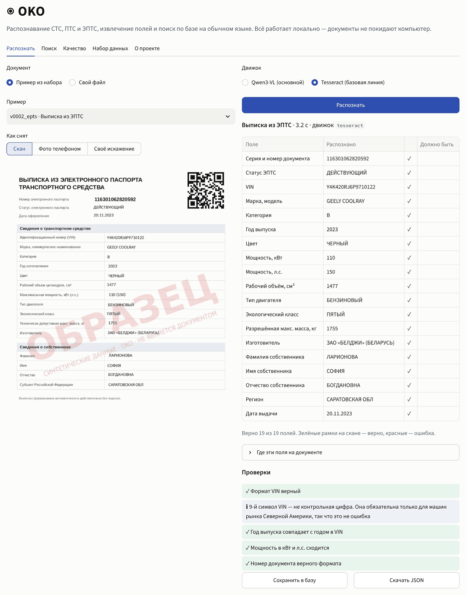
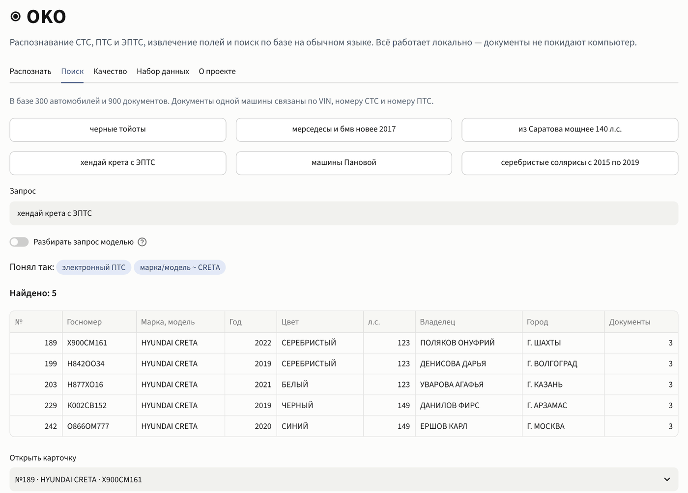
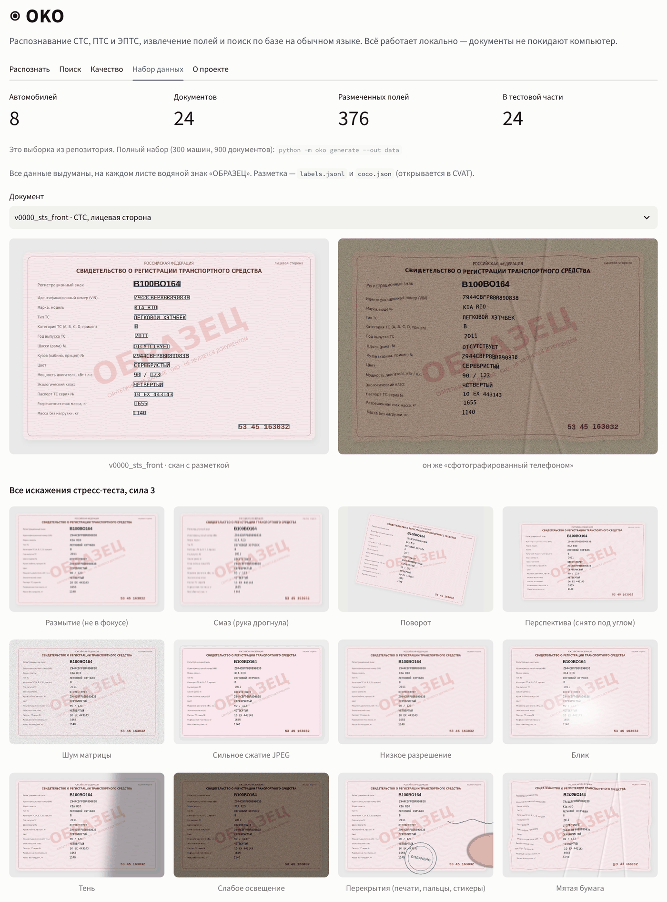
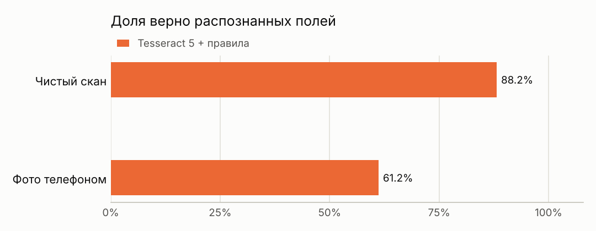
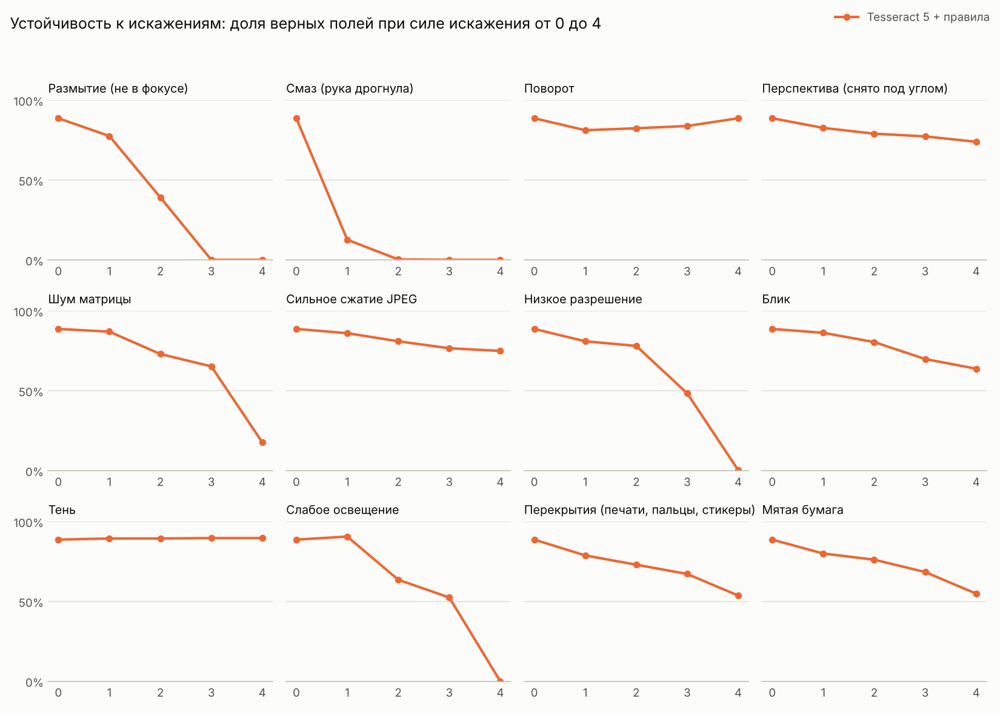
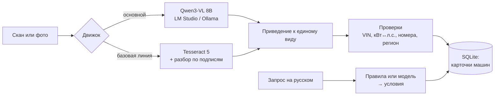

<h1 align="center">◉ OKO</h1>
<p align="center"><b>Интеллектуальный анализ документов на автомобиль: СТС, ПТС, ЭПТС</b></p>

<p align="center">
<a href="https://github.com/honeyjostar/oko/actions/workflows/ci.yml"></a>


</p>

> Нейросеть сама читает документ, раскладывает его на 29 полей, ловит ошибки в VIN и номерах, связывает СТС и ПТС одной машины и находит нужную машину по обычной фразе — *«чёрные тойоты из Саратова мощнее 150 л.с.»*. Работает на домашнем компьютере: ни один документ не уходит в интернет.

<p align="center">
<b>900</b> документов в наборе · <b>4</b> вида документов · <b>29</b> полей · <b>12</b> искажений × 4 уровня силы · <b>47</b> автотестов
</p>

OKO — пайплайн извлечения структурированных данных из документов на транспортное средство. Визуально-языковая модель (Qwen3-VL 8B, локально через OpenAI-совместимый API) получает изображение и JSON-схему полей и возвращает значения. Дальше они приводятся к каноническому виду и проходят перекрёстные проверки, после чего документы одной машины сводятся в карточку в SQLite. Запрос на естественном языке транслируется в параметризованный SQL. Качество измеряется на синтетическом размеченном наборе против классической базовой линии (Tesseract 5) и в стресс-тесте на искажения. Пошаговая установка — в [docs/INSTALL.md](docs/INSTALL.md).

<p align="center"></p>

## Что сделано

| Пункт задания | Что в проекте |
|---|---|
| Подготовка и разметка набора типовых документов | Генератор синтетических СТС (обе стороны), бумажных ПТС и выписок ЭПТС: **300 машин → 900 документов**, у каждого — скан, «фото телефоном», значения всех полей и рамки полей. Экспорт в COCO — открывается в CVAT. Данные выдуманные, на каждом листе водяной знак «ОБРАЗЕЦ». |
| Исследование и сравнение моделей распознавания | Два подхода на одном наборе и одних метриках: классический OCR (Tesseract 5 + разбор по подписям полей) и визуально-языковая модель **Qwen3-VL 8B**, которая читает документ целиком и сразу отдаёт поля по JSON-схеме. Выбор модели обоснован открытыми бенчмарками — [ниже](#почему-qwen3-vl-8b). |
| Структурированное извлечение и поиск по запросу в свободной форме | Поля приводятся к единому виду (латиница/кириллица, номера, даты) и проверяются: формат VIN и год в VIN, кВт ↔ л.с., масса, формат номеров, регион по госномеру. Документы одной машины связываются по VIN, номеру СТС и номеру ПТС. Поиск: правила понимают марки во всех падежах, цвета, годы и диапазоны, мощность, объём, город и регион, фамилию владельца; модель может разбирать более свободные запросы — её ответ проходит белый список колонок и операций, SQL только с параметрами. |
| Оценка устойчивости к искажениям, перекрытиям и сложной компоновке | Стресс-тест: 12 искажений × 4 уровня силы — размытие, смаз, поворот, перспектива, шум, JPEG, низкое разрешение, блик, тень, темнота, **перекрытие** (палец, скрепка, стикер), **помятость**. Сложная компоновка — бумажный ПТС: 24 нумерованные строки в таблице, подписи в несколько строк, печать поверх. |

<table>
<tr>
<td width="50%"></td>
<td width="50%"></td>
</tr>
<tr>
<td align="center">Поиск: запрос → условия → карточка машины со всеми документами</td>
<td align="center">Набор: скан с рамками полей, «фото телефоном», 12 искажений стресс-теста</td>
</tr>
</table>

## Результаты

<!-- results:start -->

Тестовая часть набора: 273 документа, каждый — в двух вариантах: скан и фото телефоном.

| Движок | Скан: верных полей | Фото: верных полей | Фото: документов без ошибок | Время на одно фото |
|---|---|---|---|---|
| **Tesseract 5 + правила** | 88.2% | 61.2% | 5.5% | 3.0 с |

> Замер основной модели Qwen3-VL 8B делается на компьютере с видеокартой: `scripts\eval_vlm.bat`. После прогона таблица и графики здесь обновятся сами (`python -m oko report`).

<picture><source media="(prefers-color-scheme: dark)" srcset="docs/img/overview-dark.png"></picture>

<picture><source media="(prefers-color-scheme: dark)" srcset="docs/img/robustness-dark.png"></picture>

Все таблицы: [docs/REPORT.md](docs/REPORT.md). Сырые ответы движков: `results/<движок>/records.jsonl`.

<!-- results:end -->

**Как читать.** «Верных полей» — доля полей, значение которых совпало с разметкой после приведения к единому виду (регистр, пробелы, похожие латинские и русские буквы, формат даты). «Документов без ошибок» — документы, где верны *все* поля. Время — медиана на документ.

**Что видно по базовой линии.** Tesseract хорошо читает чистый скан (88% полей), но на фото телефоном падает до 61%, а документов, прочитанных без единой ошибки, остаётся около 5%. На фото строки перекашиваются, подпись поля перестаёт стоять на одной линии со значением, тень и блик съедают часть букв. Хуже всего даются длинные коды — модель двигателя, VIN, номер кузова: одна перепутанная буква, и поле неверно. Поэтому основной движок — модель, которая смотрит на документ целиком.

## Как устроено



- **Qwen3-VL** получает картинку и инструкцию с описанием всех полей, отвечает JSON по схеме (`response_format: json_schema`). Если сервер схему не поддерживает, клиент сам переходит на JSON в тексте. Клиент один на любой OpenAI-совместимый сервер: LM Studio, Ollama, llama.cpp, vLLM.
- **Tesseract** — классическая базовая линия: выравнивание освещения, бинаризация, выпрямление наклона, удаление линий таблицы, затем строки делятся на «подпись — значение» и подписи сопоставляются нечётким поиском.
- Результаты обоих движков проходят одну и ту же чистку, поэтому сравнение одинаковое для всех.

## Почему Qwen3-VL 8B

Модель выбрана по открытым данным и требованиям задачи:

- **Открытая лицензия Apache 2.0** и открытые веса — можно запускать у себя без ограничений ([карточка модели](https://huggingface.co/Qwen/Qwen3-VL-8B-Instruct)).
- **OCR на 32 языках**, включая русский, и заявленная устойчивость к плохому свету, размытию и наклону ([карточка модели](https://huggingface.co/Qwen/Qwen3-VL-8B-Instruct), [страница в Ollama](https://ollama.com/library/qwen3-vl)).
- **Помещается в обычную видеокарту**: версия 8B в Ollama весит 6,1 ГБ ([Ollama](https://ollama.com/library/qwen3-vl)). Документы не уходят в облако — для ПТС и СТС с ФИО и адресом это обязательно.
- **Одна модель на две задачи**: и раскладывает документ по полям схемы, и разбирает поисковый запрос.

Специализированные OCR-модели — PaddleOCR-VL-1.6 (96,34% на OmniDocBench v1.6) и GLM-OCR (95,22%) — сейчас лучшие в распознавании текста и разметки страницы, у Qwen3-VL-235B на том же бенчмарке 89,78% ([обзор Roboflow](https://roboflow.com/blog/best-open-source-ocr-models)). Но они отдают текст страницы, а не поля документа, — понадобился бы ещё один шаг. Движок в OKO не привязан к модели: другую подключить можно опцией `--model`, и она пройдёт тот же замер.

## Запуск

Подробно по шагам, с решением типичных проблем — [docs/INSTALL.md](docs/INSTALL.md).

### Windows

1. Установить **Python 3.11+** с [python.org](https://www.python.org/downloads/) (галочка «Add python.exe to PATH»).
2. Установить **Tesseract** ([сборка UB Mannheim](https://github.com/UB-Mannheim/tesseract/wiki)), в установщике отметить русский язык.
3. Запустить `scripts\setup.bat` — создаст окружение и поставит зависимости.
4. Запустить `scripts\demo.bat` — откроется демо в браузере.

Для основной модели:

5. Установить [LM Studio](https://lmstudio.ai), найти и скачать **Qwen3-VL 8B**, на вкладке *Developer* нажать *Start Server*.
   Или [Ollama](https://ollama.com): `ollama pull qwen3-vl:8b` и `set OKO_VLM_URL=http://127.0.0.1:11434/v1`.
6. `scripts\eval_vlm.bat` — замер модели на тестовой части и стресс-тест; в конце обновятся отчёт и таблица выше. Прогон можно прервать — при повторном запуске готовое не пересчитывается.

### Linux / macOS / Docker

```bash
scripts/setup.sh && scripts/demo.sh        # Tesseract: apt install tesseract-ocr tesseract-ocr-rus
docker compose up                          # то же в контейнере, демо на http://localhost:8501
```

### Командная строка

```bash
python -m oko generate --out data --vehicles 300       # набор данных
python -m oko extract фото_стс.jpg                     # распознать документ (по умолчанию Qwen3-VL)
python -m oko extract фото_стс.jpg --engine tesseract
python -m oko eval --engine vlm --data data            # качество на тестовой части
python -m oko robustness --engine vlm --data data      # стресс-тест
python -m oko report --data data                       # графики, docs/REPORT.md и таблица в README
python -m oko db-fill --data data                      # демо-база
python -m oko search "белые киа 2018 года"
python -m oko doctor                                   # всё ли установлено
```

Адрес сервера и имя модели: `--url`, `--model` или переменные `OKO_VLM_URL`, `OKO_VLM_MODEL`.

## Набор данных

| | |
|---|---|
| Виды документов | СТС лицевая сторона (16 полей), СТС оборот (9), ПТС бумажный (25), выписка ЭПТС (19) |
| Объём | 300 машин, 900 документов, 14 346 размеченных полей с рамками |
| Варианты | чистый скан и «фото телефоном»: 2–4 мягких искажения сразу из перспективы, поворота, помятости, тени, блика, темноты, размытия, шума и сжатия |
| Разделение | dev / test = 70 / 30 по машинам: документы одной машины не попадают в обе части |
| Формат | `labels.jsonl` (значения и рамки), `coco.json` (для CVAT), картинки JPEG |

Набор полностью воспроизводим: `python -m oko generate --out data --vehicles 300 --seed 42` на любом компьютере даёт ту же разметку (отпечаток `74eaab745091`). Результаты движков привязаны к отпечатку, поэтому посчитать качество на другом наборе по ошибке нельзя. В репозитории лежит выборка `data_sample/` (8 машин, 24 документа) — демо работает сразу после клонирования.

Данные правдоподобные, но выдуманные: VIN с правильной структурой и годом в 10-м символе, госномера из разрешённых букв с кодом региона владельца, мощность в кВт и л.с. сходится, масса без нагрузки меньше разрешённой. Модели машин и производители — реальные, люди и адреса — нет.

## Ограничения

- **Только синтетика.** Настоящие бланки отличаются шрифтами, защитной сеткой, голограммами, рукописными пометками. Цифры на синтетике — оценка сверху; следующий шаг — проверка на настоящих документах с согласия владельцев и с обезличиванием.
- Разбор Tesseract настроен на раскладку этих бланков; на другом бланке его придётся донастроить. Модели это не нужно.
- Поиск правилами понимает типичные формулировки; для свободных — режим «Разбирать запрос моделью».

## Структура

```
oko/
  schema.py        виды документов и 29 полей
  fakedata.py      правдоподобные машины, VIN, госномера, владельцы
  render.py        отрисовка СТС, ПТС, ЭПТС + рамки полей
  distort.py       12 искажений для стресс-теста и «фото телефоном»
  dataset.py       сборка набора, COCO, отпечаток
  engines/vlm.py   клиент Qwen3-VL (OpenAI-совместимый API)
  engines/tesseract.py  базовая линия
  normalize.py     приведение к единому виду и проверки
  db.py            SQLite: документы и карточки машин
  search.py        поиск запросом на русском
  evaluate.py      прогон, метрики, кривые устойчивости
  report.py        графики и отчёт
app.py             демо на Streamlit
tests/             тесты pytest, запускаются в GitHub Actions на каждый push
```

## Команда

| Участник | Роль | Задача | Статус |
|---|---|---|---|
| **yaposspall** · [@honeyjostar](https://github.com/honeyjostar) | Автор, руководитель | Текущая версия: набор данных, распознавание, проверки, поиск, замер качества, демо. Ревью задач команды | ✅ сделано |
| **Savina** | Лидер команды | Руководство проектом, постановка задач команде | ✅ сделано |
| **Viktoriya Tarbeeva** | Данные | Собрать 20–30 настоящих СТС и ПТС с согласия владельцев и обезличить персональные данные | ✅ сделано |
| **Alay** | Разметка | Разметить реальные документы в CVAT по схеме полей OKO (импорт `coco.json`) | ✅ сделано |
| **Lukonin** | — | — | — |
| **Pavel** | Новый документ | Добавить водительское удостоверение: поля, генератор, проверки | ✅ сделано |
| **Rufova** | Защита | Презентация и демо-сценарий для защиты, проверка инструкции глазами нового пользователя | ✅ сделано |
