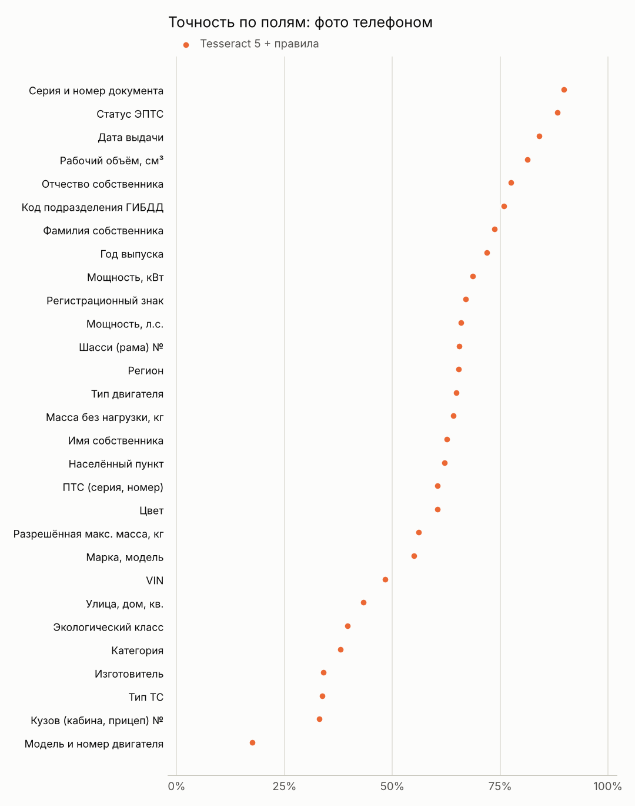
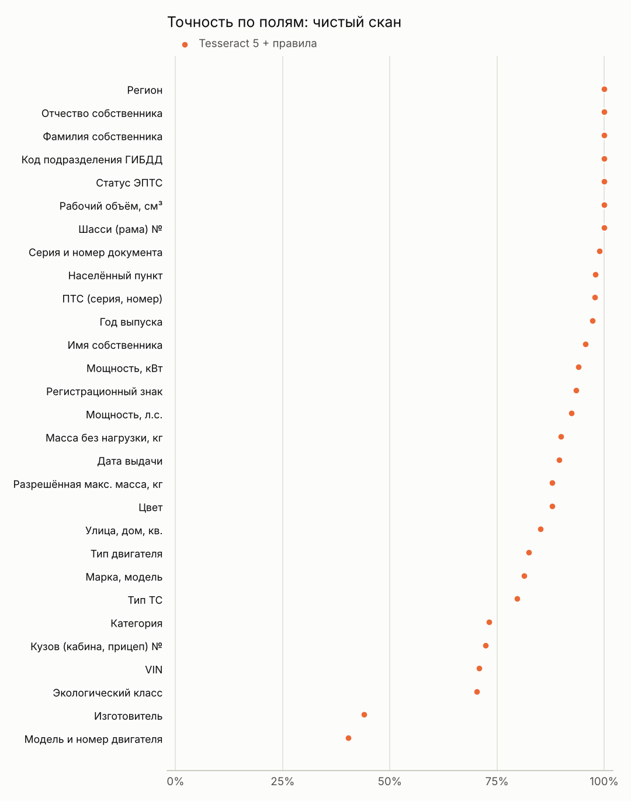

# Отчёт о качестве

Все цифры получены прогоном на синтетическом наборе (тестовая часть). Файлы с сырыми результатами: `results/<движок>/records.jsonl`, сводки: `summary.json`.

## Итог

| Движок | Вариант | Документов | Верных полей | Документов без единой ошибки | Вид документа определён | CER | Время на документ |
|---|---|---|---|---|---|---|---|
| Tesseract 5 + правила | Чистый скан | 273 | 88.2% | 30.8% | 100.0% | 0.064 | 1.2 с |
| Tesseract 5 + правила | Фото телефоном | 273 | 61.2% | 5.5% | 98.5% | 0.323 | 3.0 с |

CER — доля неверных символов в значении поля (0 — идеально).

<picture><source media="(prefers-color-scheme: dark)" srcset="img/overview-dark.png"></picture>

## По видам документов

| Движок | Вариант | СТС, лицевая сторона | СТС, оборот | ПТС (бумажный) | Выписка из ЭПТС |
|---|---|---|---|---|---|
| Tesseract 5 + правила | Чистый скан | 87.4% | 96.1% | 82.5% | 92.4% |
| Tesseract 5 + правила | Фото телефоном | 56.7% | 73.0% | 52.6% | 75.1% |

## Устойчивость к искажениям

Каждое искажение применялось отдельно, с силой от 1 до 4, к одним и тем же 24 документам (поровну каждого вида). Уровень 0 — чистый скан этих же документов.

<picture><source media="(prefers-color-scheme: dark)" srcset="img/robustness-dark.png"></picture>

| Искажение | Tesseract 5 + правила, сила 2 | Tesseract 5 + правила, сила 4 |
|---|---|---|
| Размытие (не в фокусе) | 39.1% | 0.0% |
| Смаз (рука дрогнула) | 0.2% | 0.0% |
| Поворот | 82.4% | 88.6% |
| Перспектива (снято под углом) | 79.0% | 73.9% |
| Шум матрицы | 72.9% | 17.6% |
| Сильное сжатие JPEG | 80.9% | 74.9% |
| Низкое разрешение | 78.0% | 0.2% |
| Блик | 80.4% | 63.8% |
| Тень | 89.4% | 89.6% |
| Слабое освещение | 63.5% | 0.0% |
| Перекрытия (печати, пальцы, стикеры) | 72.9% | 53.6% |
| Мятая бумага | 76.1% | 54.8% |

## Точность по полям

<picture><source media="(prefers-color-scheme: dark)" srcset="img/fields-photo-dark.png"></picture>

<picture><source media="(prefers-color-scheme: dark)" srcset="img/fields-clean-dark.png"></picture>
